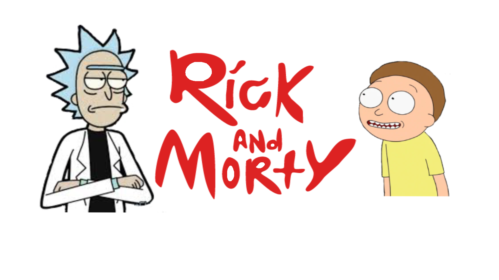

# Data Lovers

## 2. Resumen del proyecto

En este proyecto  se trabajo con la data de Rick and Morty, para seguir aprendiendo DOM, HTML y Js 
Se trabajo en dupla para poder avanzar y poder entender como piensa, buena comunicación con las compañeras
### UX

- [x] Diseñar la aplicación pensando y entendiendo al usuario.
- [x] Crear prototipos para obtener _feedback_ e iterar.  
- [x] Aplicar los principios de diseño visual (contraste, alineación, jerarquía).
- [X] Planear y ejecutar _tests_ de usabilidad.

### HTML y CSS

- [x] Entender y reconocer por qué es importante el HTML semántico.
- [x] Identificar y entender tipos de selectores en CSS.
- [x] Entender como funciona `flexbox` en CSS.
- [x] Construir tu aplicación respetando el diseño planeado (maquetación).

### DOM

- [x] Entender y reconocer los selectores del DOM (querySelector | querySelectorAll).
- [x] Manejar eventos del DOM. (addEventListener)
- [x] Manipular dinámicamente el DOM. (createElement, appendchild, innerHTML, value)

### Javascript

- [x] Manipular arrays (`filter` | `map` | `sort` | `reduce`).
- [ ] Manipular objects (key | value).
- [x] Entender el uso de condicionales (`if-else` | `switch`).
- [x] Entender el uso de bucles (`for` | `forEach`).
- [x] Entender la diferencia entre expression y statements.
- [x] Utilizar funciones (parámetros | argumentos | valor de retorno).
- [x] Entender la diferencia entre tipos de datos atómicos y estructurados.
- [x] Utilizar ES Modules (`import` | `export`).

### Pruebas Unitarias (_testing_)
- [ ] Testear funciones (funciones puras).

### Git y GitHub
- [x] Ejecutar comandos de git (`add` | `commit` | `pull` | `status` | `push`).
- [X] Utilizar los repositorios de GitHub (`clone` | `fork` | gh-pages).
- [ ] Colaborar en Github (pull requests).

### Buenas prácticas de desarrollo
- [x] Organizar y dividir el código en módulos (Modularización).
- [X] Utilizar identificadores descriptivos (Nomenclatura | Semántica).
- [X] Utilizar linter para seguir buenas prácticas (ESLINT).

## 4. Consideraciones generales

* Este proyecto se debe resolver en duplas.
* El proyecto será entregado subiendo tu código a GitHub (`commit`/`push`) y la
  interfaz será desplegada usando [GitHub Pages](https://pages.github.com/).
* Tiempo: toma como referencia 3 semanas.

## 5. Criterios de aceptación mínimos del proyecto

Los criterios que deberás considerar para saber si has completado este proyecto
son:

### Definición del producto

El proceso del diseño, se trabajo con los colores que puede ser amable para el usuario
tambien, se vio los colores comunes de la caricatura.
Se vio los tipos de tipografia que son mas comunes en las app.
En un inicio no se vio un diseño tan llamativo para el usaurio.

### Historias de usuario

Se crearon historias de usuarios simples. 
La primera fue la búsqueda del personaje por medio de un input o caja de texto
donde el usuario pueda escribir el nombre del personaje, pero hubo una problemática ahí
que se tendría que poner el nombre completo para realizar la búsqueda final.
Para resolver esta problemática buscamos la solución en js, con expresión regular, 
Las demás historias, fueron la búsqueda de personas por medio de un menú al dar click en los
iconos, que son primarios, secundarios, vivos, muertos, femeninos, masculinos etc

### Diseño de la Interfaz de Usuario

#### Prototipo de baja fidelidad
  Se realizo prototipo a lapiz, para resolver las historias de usuarios
    
	 
	
   

#### Prototipo de alta fidelidad

se trabajo con Fedma.

  
  
 
  
 
 
 
#### Testeos de usabilidad

Se realizo feedback con las chicas de laboratoria.

### Implementación de la Interfaz de Usuario (HTML/CSS/JS)
Asi quedo el proyecto final,
  
   
  
   
  
   
  
   
  
  Proyecto en línea funcionando. 
  
  https://elizaflores11.github.io/CDMX009-Data-Lovers/docs/
  
### Pruebas unitarias

Se modifico el codigo inicial, con la parte de eslint, falta todavia trabajar con esa parte
